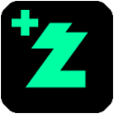

# Chzzk Plus

    

 

    <a href="https://chzzk.naver.com/">치지직</a> 확장 프로그램 

    
    
    

## Feature

### 1. PIP 모드 버튼

### 2. 방송화면 이벤트 방해 방지

## 고려중

1. 팔로우 채널 우선순위 순위
2. 채널 (썸네일) Hover 시 생방송 미리보기
3. 품질 조절 기타 등등

## 알림사항

모든 기여 및 아이디어 환영합니다.

본 확장 프로그램은 naver.com 과 chzzk.naver.com 과 관련이 없습니다.
